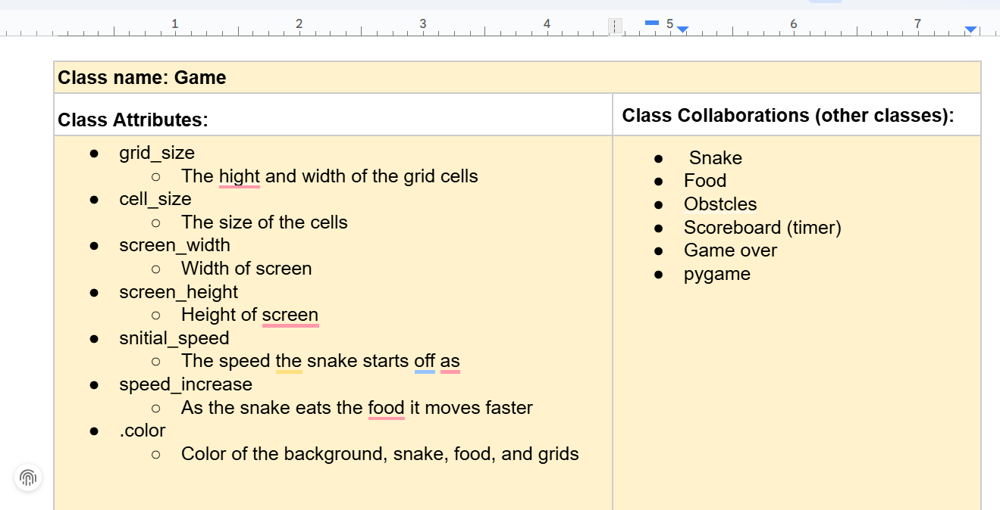
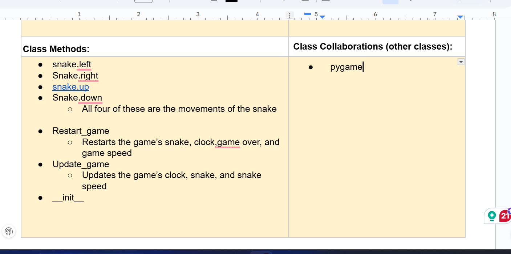

# CSC226 Final Project

## Instructions

Exclamation Marks indicate action items; you should remove these emoji as you complete/update the items which 
  they accompany. (This means that your final README should have no in it!)

**Author(s)**: Mushfiq, MJ

**Google Doc Link**: https://docs.google.com/document/d/1aZkqy4GDyJ-fL_T7bfjBfsyupfikekpHseor6yZvuSg/edit?usp=sharing

---

## Milestone 1: Setup, Planning, Design

**Title**: `Python Rush`

**Purpose**: `Create an interactive, object-oriented snake game where the snake grows with each food item, navigates 
obstacles, and ends the game upon boundary, self-, or obstacle-collision.`

**Source Assignment(s)**: `T11: The Legend of Tuna: Breath of Catnip, T12: Events and GUIs, T10: Intro to Classes`

**CRC Card(s)**:
  - Create a CRC card for each class that your project will implement. 
  - See this link for a sample CRC card and a template to use for your own cards (you will have to make a copy to edit):
    [CRC Card Example](https://docs.google.com/document/d/1JE_3Qmytk_JGztRqkPXWACJwciPH61VCx3idIlBCVFY/edit?usp=sharing)
  - Tables in markdown are not easy, so we suggest saving your CRC card as an image and including the image(s) in the 
    README. You can do this by saving an image in the repository and linking to it. See the sample CRC card below - 
    and REPLACE it with your own:
  

 

**Branches**: This project will **require** effective use of git. 

Each partner should create a branch at the beginning of the project, and stay on this branch (or branches of their 
branch) as they work. When you need to bring each others branches together, do so by merging each other's branches 
into your own, following the process we've discussed in previous assignments, then re-branching out from the merged code.  

```
    Branch 1 starting name: mushfiqmahim-P01-Final-Project
    Branch 2 starting name: BynumM
```

### References 

Throughout this project, you will likely use outside resources. Reference all ideas which are not your own, 
and describe how you integrated the ideas or code into your program. This includes online sources, people who have 
helped you, AI tools you've used, and any other resources that are not solely your own contribution. Update this 
section as you go. DO NOT forget about it!

Pygame Documentation — used for understanding rendering and collisions.
Python Docs — used for class structure and general language help.
StackOverflow — used for fixing test import issues.
Claude — used for debugging, improving game design, and writing comment suggestions.
Course Material — used for milestone requirements and project structure.
Pygame Tutorials — used for basic ideas behind the game loop logic.

---

## Milestone 2: Code Setup and Issue Queue

Most importantly, keep your issue queue up to date, and focus on your code. 🙃

Reflect on what you’ve done so far. How’s it going? Are you feeling behind/ahead? What are you worried about? 
What has surprised you so far? Describe your general feelings. Be honest with yourself; this section is for you, not me.

```
    We were worried at first because setting up the new files and managing branches felt confusing, but once we got into 
    the workflow it started to make more sense. Creating the project structure, writing stubbed-out functions, solving 
    an issue, and merging into the main branch all helped us feel more confident in using Git collaboratively. We were 
    also surprised by how important the issue queue is for keeping the project organized—it actually helped us understand 
    what steps we need to take next. Right now, we feel slightly behind in terms of how much code is implemented, but 
    ahead in terms of project structure and organization. Our biggest worry is coordinating commits with each other so 
    the work is evenly balanced and merged correctly. Still, we feel good that we have a solid foundation and that the 
    basic game loop and snake movement are already working. We are feeling more confident with the project now than 
    when we started, and we think we’re moving in the right direction. 
```

---

## Milestone 3: Virtual Check-In

Indicate what percentage of the project you have left to complete and how confident you feel. 

**Completion Percentage**: `65%` 

**Confidence**: Describe how confident you feel about completing this project, and why. Then, describe some 
  strategies you can employ to increase the likelihood that you'll be successful in completing this project 
  before the deadline.

```
    I feel moderately confident about completing this project on time. The core framework of the game is already built —
    the game loop, movement, obstacles, game-over screen, and restart/quit flow are working correctly. The next features, 
    such as scoring, food collision logic, improving gameplay, and writing initial tests, are very manageable. My biggest 
    concern is making sure all features integrate cleanly and that both partners contribute enough for the final grading 
    requirements. Now that the structure is set up, adding new features should be much easier and more organized.
    
    To increase the likelihood of finishing successfully, I plan to:
1. Continue working on a feature-by-feature basis using clear GitHub issues
2. Keep branches updated and merge changes frequently to avoid conflicts
3. Finish the remaining core features (score, collisions, keyboard logic) early
4. Create new test file 
```

---

## Milestone 4: Final Code, Presentation, Demo

### User Instructions

In a paragraph, explain how to use your program. Assume the user is starting just after they hit the "Run" button 
in PyCharm. 

After hitting the “Run” button in PyCharm, the Snake game window will open automatically. Use the arrow keys to move the 
snake: Up, Down, Left, and Right. The goal is to guide the snake to eat the red food pieces, which increases the score 
by 5 points, if it eats the blue-gold food it increases the score by 20 and makes the snake grow longer. Every 20 points, 
the level increases and the game becomes slightly faster. Avoid running into the walls, Snake's own body, or any gray 
obstacles—hitting any of these will end the game. If it needs to be paused at any time, press P, and press P again to 
resume. When the “Game Over” screen appears, press R to restart the game or press ESC to quit. That's all is needed to 
start playing!

### Errors and Constraints

Every program has bugs or features that had to be scrapped for time. These bugs should be tracked in the issue queue. 
You should already have a few items in here from the prior weeks. Create a new issue for any undocumented errors and 
deficiencies that remain in your code. Bugs found that aren't acknowledged in the queue will be penalized.

Throughout the project, I actively used the GitHub issue queue to track bugs, missing features and planned improvements. 
Some issues such as direction reversal, food not respawning and snake-eye misalignment were identified, documented and 
then fixed and closed. Other enhancements—like dynamic obstacle generation, additional visual polish and a more advanced 
scoreboard—were added to the queue but intentionally left open as future improvements due to time limits.
 
###  Reflection

Each partner should write three to four well-written paragraphs address the following (at a minimum):
- Why did you select the project that you did?
- How closely did your final project reflect your initial design?
- What did you learn from this process?
- What was the hardest part of the final project?
- What would you do differently next time, knowing what you know now?
- How well did you work with your partner? What made it go well? What made it challenging?

```
    (Mushfiq)
    We chose to create a Snake game because it felt like the perfect balance between something familiar and something 
    challenging enough to push our skills. Snake is simple on the surface but once we started building it with proper 
    classes, collision logic, movement rules, growth mechanics, scoring and increasing difficulty, we realized how many 
    different concepts come together. It also gave us room to be creative—we added levels, special food, obstacles, a HUD, 
    pause functionality and visual polish like changing colors and eye animations. It was fun working on this project.

Our final project ended up being almost exact to our initial plan but definitely more polished and structured. In the 
beginning, we only imagined a basic snake game with movement and food. By the end, we had a multi-file system with Snake, 
Food, Game, and Obstacle classes, a full game loop, level progression, a Game Over screen, difficulty scaling and unit 
tests for snake, food and obstacles. Some features changed along the way—like scrapping portals to prevent unnecessary 
bugs—but the main vision stayed the same. The game turned out cleaner and more complete than the original sketch.

This project taught us a lot about planning, debugging and writing code in manageable pieces. I learned how important it 
is to separate files, use incremental development and rely on the issue queue to track real bugs and future improvements. 
I also learned how to write unit tests and how having tests makes you think differently about your code structure. 
Most importantly, I learned how essential it is to keep the code organized.

The hardest part of the project was debugging unexpected behavior—especially food not respawning, directional glitches 
that allowed 180-degree turns, hitbox inconsistencies near the top margin and making sure the snake’s movement was smooth 
and predictable. Managing imports for the test suite and figuring out how to write tests for separate files was also 
challenging. There were moments where everything seemed to work and then suddenly a new bug would appear, so the process 
was very iterative. But each bug taught us something different.

If I had to redo the project, I would set up the structure, stubs and test files earlier. I would also avoid big feature 
jumps (like trying portals) and instead focus on incremental, stable changes. Now that I know how to organize code across 
multiple modules and how powerful the issue queue is, I would start with a clearer development plan.

As for partnership, I contributed a large portion of the coding and testing, but I still tried to communicate updates and 
organize the work clearly. The most challenging part was the imbalance in workload but I still kept things collaborative 
by merging branches, documenting everything in the issue queue, and keeping the project organized for both of us.
```

```
    Partner 2: **Replace this with your reflection
```

---